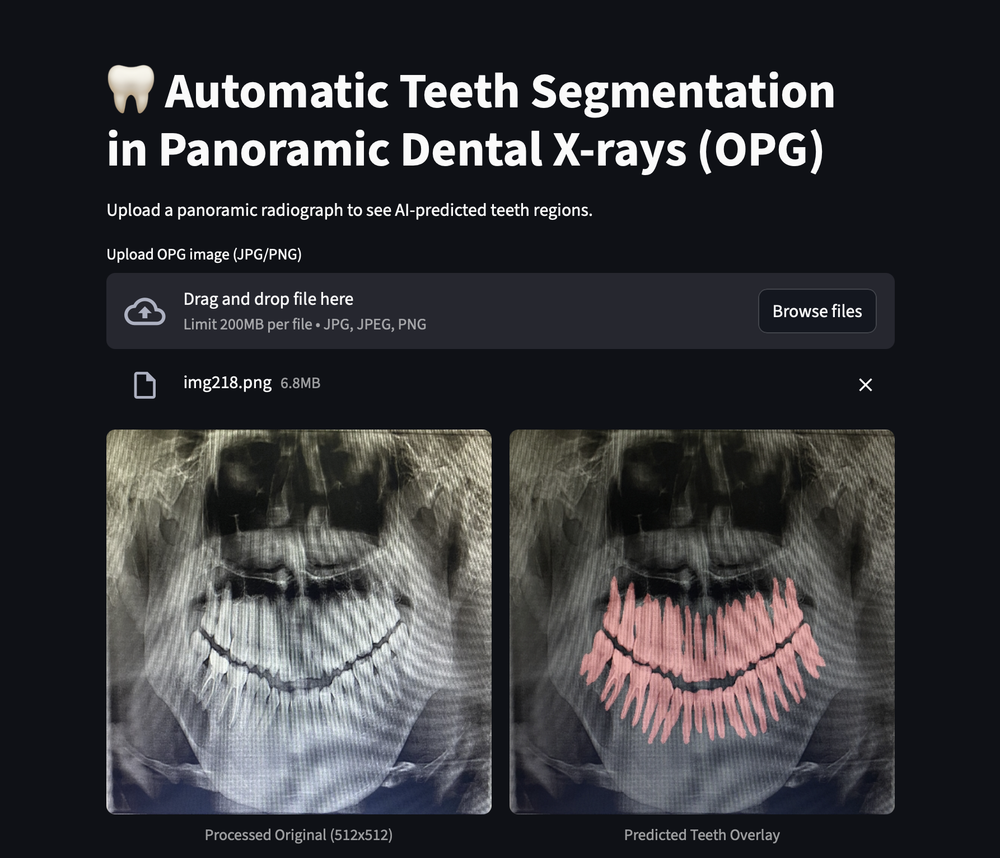

# Automatic Teeth Segmentation in Panoramic Dental OPG X-rays

An intelligent deep learning application designed to automatically segment and identify teeth regions in panoramic dental X-ray images. This tool assists dentists and dental professionals in clinical analysis by providing precise AI-powered segmentation of dental structures.

## Project Demo



## Overview

This project leverages state-of-the-art semantic segmentation models (UNet and UNet++) to detect and segment individual teeth in panoramic X-ray images. The application is built with Streamlit, making it user-friendly and accessible for dental professionals with minimal technical expertise.

**Key Application:**
- Assists dentists in automated teeth segmentation from panoramic radiographs (OPG - Orthopantomography)
- Provides real-time visual feedback with overlay visualization
- Supports clinical workflow integration for dental analysis

## Features

- **AI-Powered Segmentation**: Uses trained UNet++ (ResNet50 encoder) for high-accuracy teeth detection
- **User-Friendly Interface**: Built with Streamlit for intuitive web-based interaction
- **Real-Time Processing**: Instant segmentation feedback on uploaded X-ray images
- **Visual Overlay**: Side-by-side comparison of original image and segmentation prediction
- **GPU Acceleration**: Optimized for CUDA-enabled GPUs (falls back to CPU if unavailable)
- **Image Preprocessing**: CLAHE-based enhancement and normalization for improved model performance
- **Multiple Format Support**: Accepts JPG and PNG image formats

## Dataset

**Dataset Details:**
- **Total Images**: 304 panoramic dental X-ray images
- **Source**: Captured using smartphone camera to protect patient privacy
- **Data Acquisition**: Smartphone-based imaging approach ensures no sensitive patient information is stored
- **Annotation Tool**: Roboflow platform with specialized segmentation tool
- **Processing**: Manual cleaning and validation of annotations for dataset quality

## Model Architecture

The project implements two semantic segmentation architectures:

### **Primary Model: UNet++**
- **Architecture**: UNet Plus Plus (nested U-Net)
- **Encoder**: ResNet50 backbone
- **Input Channels**: 3 (RGB)
- **Output Classes**: 1 (binary segmentation - teeth/non-teeth)
- **Activation**: Sigmoid for binary classification
- **Framework**: Segmentation Models PyTorch (SMP)

### **Alternative Model: UNet**
- Tested as baseline architecture for comparison
- Utilized for model performance evaluation

**Key Advantages of UNet++:**
- Improved semantic segmentation accuracy through nested skip connections
- Better feature representation learning
- Enhanced boundary detection for tooth regions

## Installation

### Prerequisites
- Python 3.8 or higher
- pip or conda package manager
- CUDA-capable GPU (optional, but recommended for faster inference)

### Step 1: Clone/Setup the Project
```bash
cd "AI Dental X-ray Segmentation"
```

### Step 2: Install Dependencies
```bash
pip install -r requirements.txt
```

Or install manually:
```bash
pip install streamlit torch segmentation-models-pytorch albumentations Pillow opencv-python numpy
```

### Step 3: Download the Model File
The pre-trained model is hosted on Google Drive due to its large size (exceeds GitHub limits).

**Download the model:**
1. Visit: [Download Model from Google Drive](https://drive.google.com/file/d/1HNjEPQaPN4ztgxjrWnvRs9bkyCiUmqkS/view?usp=drive_link)
2. Click the download button (↓ icon in the top-right)
3. Place the downloaded file `best_unetpp_from_scratch_smp_resnet50.pth` in the project root directory

**Verify the model file:**
```bash
# Check that the model file exists in the project directory
ls -la best_unetpp_from_scratch_smp_resnet50.pth
```

## Usage Guide

### Running the Application

```bash
streamlit run app.py
```

The application will launch at `http://localhost:8501` by default.

### Step-by-Step Usage

1. **Launch the Application**
   ```bash
   python3 -m streamlit run app.py
   ```

2. **Upload an OPG Image**
   - Click on "Upload OPG image (JPG/PNG)"
   - Select a panoramic dental X-ray image from your computer

3. **Wait for Processing**
   - The model automatically preprocesses and segments the image
   - Processing typically takes 2-5 seconds depending on hardware

4. **View Results**
   - **Left Panel**: Processed original image (512×512 resolution)
   - **Right Panel**: Segmentation overlay showing predicted teeth regions in light red
   - Teeth regions are highlighted with semi-transparent red overlay for easy identification

5. **Analyze and Export**
   - Screenshots of results can be saved directly from the browser
   - Use browser's developer tools or screen capture for clinical documentation

### Input Specifications
- **Format**: JPG, JPEG, or PNG
- **Recommended Resolution**: 1024×1024 pixels or higher
- **Color Space**: RGB or grayscale (automatically converted to RGB)
- **File Size**: Up to 200MB (typical X-rays are 1-10MB)

### Output Interpretation
- **Red Overlay Regions**: Predicted tooth segmentation masks
- **Transparency Level**: 40% overlay allows visualization of underlying X-ray details
- **Display Resolution**: Automatically resized to 512×512 for consistent processing

## Technical Architecture

### Application Stack
- **Frontend**: Streamlit (Python web framework)
- **Deep Learning**: PyTorch + Segmentation Models PyTorch
- **Image Processing**: OpenCV (cv2), Albumentations, PIL
- **Model Deployment**: PyTorch checkpoint loading
- **Hardware**: CPU/GPU support with automatic device selection

### Data Preprocessing Pipeline
```
Input Image (RGB)
    ↓
Resize to 512×512
    ↓
CLAHE Enhancement (Contrast Limited Adaptive Histogram Equalization)
    ↓
Normalization (mean=0.0, std=1.0)
    ↓
Convert to PyTorch Tensor
```

### Model Inference Pipeline
```
Preprocessed Tensor
    ↓
UNet++ Model (ResNet50 encoder)
    ↓
Sigmoid Activation (probability output)
    ↓
Binary Threshold (threshold=0.5)
    ↓
Segmentation Mask
```

## Project Structure

```
AI Dental X-ray Segmentation/
├── app.py                                          # Main Streamlit application
├── best_unetpp_from_scratch_smp_resnet50.pth     # Trained model checkpoint (download from Google Drive)
├── README.md                                       # Project documentation (this file)
└── requirements.txt                               # Python dependencies
```

**Note:** The trained model file (`best_unetpp_from_scratch_smp_resnet50.pth`) is not included in the repository due to its large size. Please download it from [Google Drive](https://drive.google.com/file/d/1HNjEPQaPN4ztgxjrWnvRs9bkyCiUmqkS/view?usp=drive_link) and place it in the project root directory before running the application.

## Team & Contributors

This project was developed by a collaborative team of researchers and developers:

- **Abidur Rahman**
- **A S M Rayhan Chowdhury**
- **Syed Ali Awsaf**

## License

This project is provided for educational and research purposes. Please contact the development team for licensing inquiries.

## ⚠️ Disclaimer

**Clinical Use Notice:**
This application is developed for research and educational purposes. While it can assist in dental image analysis, it should not replace professional dental diagnosis. Always consult with qualified dental professionals for clinical decisions. The model's predictions should be reviewed and validated by dental experts before any clinical application.

**Privacy & Data Protection:**
- All X-ray images used in this project were captured using smartphone cameras to avoid storing sensitive patient information
- If using this application with real patient data, ensure compliance with HIPAA, GDPR, and local data protection regulations
- Images are processed locally and not transmitted to external servers

---

**Ready to segment some teeth?** Upload your OPG image and let AI do the work!
